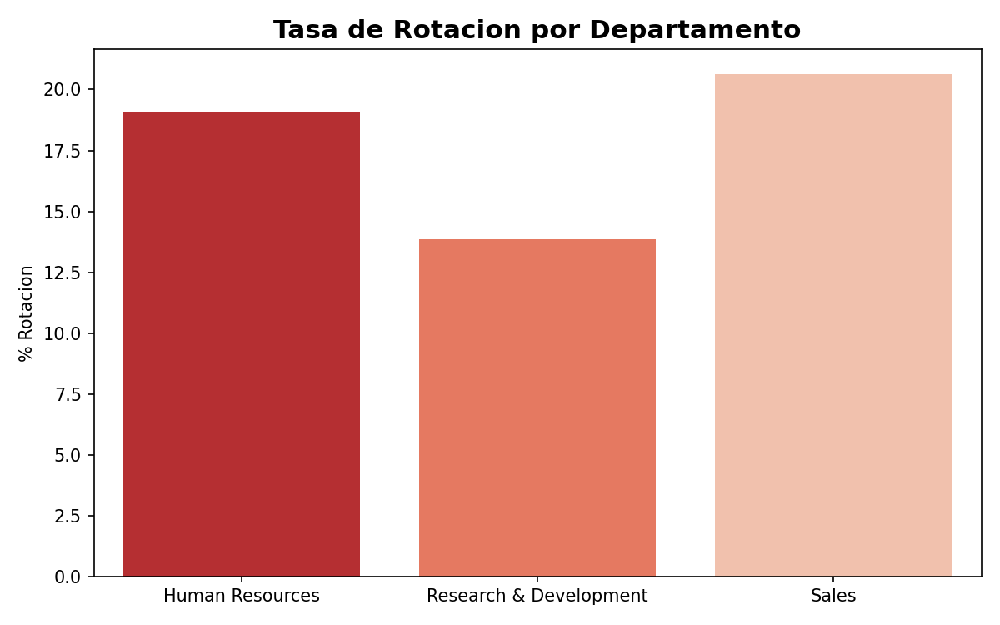
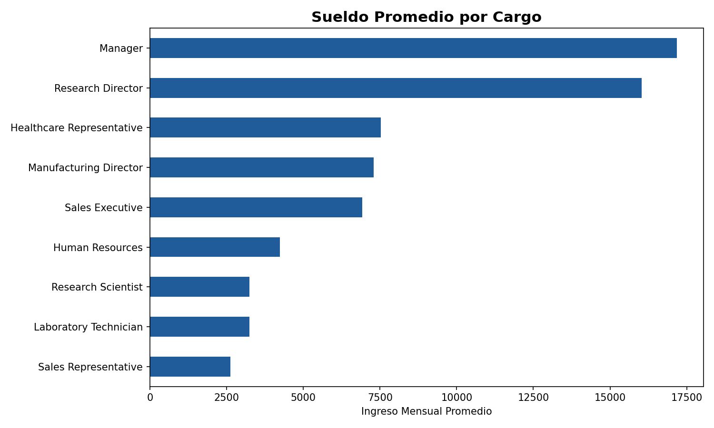
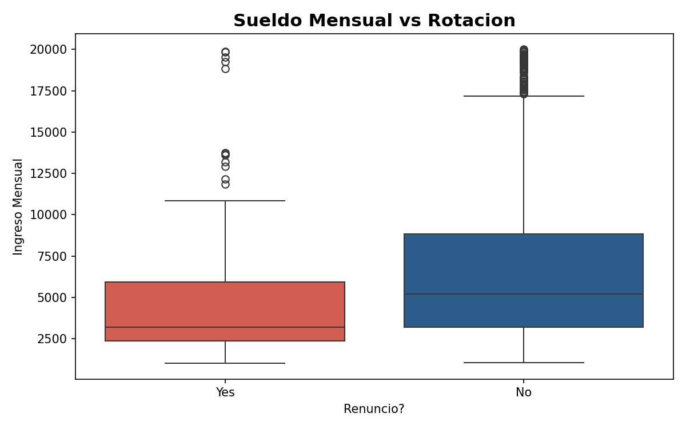

# 👥 Análisis de Rotación de Personal y Sueldos con SQL y Python

## 📌 Descripción
Análisis de recursos humanos sobre rotación de empleados e ingresos mensuales
usando SQL Server y Python.
Dataset: IBM HR Analytics Employee Attrition (1,470 empleados | 32 variables)
Fuente: https://www.kaggle.com/datasets/pavansubhasht/ibm-hr-analytics-attrition-dataset

## 🎯 Preguntas de Negocio Respondidas
- ¿Qué departamento tiene mayor tasa de rotación?
- ¿Cuál es el sueldo promedio por cargo?
- ¿Los empleados que renuncian ganan menos que los que se quedan?
- ¿Cuántos años promedio duran los empleados antes de renunciar?

## 🛠️ Herramientas Utilizadas
- Excel — limpieza y preparación de datos
- SQL Server — carga, consultas y análisis con GROUP BY, CASE WHEN, AVG
- Python — Pandas, Matplotlib, Seaborn
- Google Colab — entorno de análisis

## 📈 Hallazgos Principales
- **Sales** tiene la mayor rotación con 20.6% de empleados que renuncian
- **Manager** es el cargo mejor pagado con $17,182 de ingreso mensual promedio
- Empleados que renuncian ganan en promedio **$4,787 vs $6,833** de los que se quedan
- Los empleados que renuncian tienen en promedio **5.1 años** en la empresa
vs 7.4 años los que permanecen

## 📊 Visualizaciones

### Tasa de Rotación por Departamento


### Sueldo Promedio por Cargo


### Sueldo Mensual vs Rotación


## 📂 Estructura del Proyecto
```
├── notebooks/    # Análisis completo en Python
├── imagenes/     # Graficos generados
└── README.md
```

## 📥 Cómo Reproducir el Análisis
1. Descarga el dataset desde Kaggle (link arriba)
2. Guarda el CSV con separador punto y coma
3. Abre el notebook en Google Colab
4. Ejecuta las celdas en orden

## 👤 Autor
**Rodrigo Antonio Aniceto Nuñez**
Analista de Datos | Lima, Perú
[LinkedIn](https://linkedin.com/in/rodrigo-aniceto-nuñez) |
[GitHub](https://github.com/RodrigoAN19)